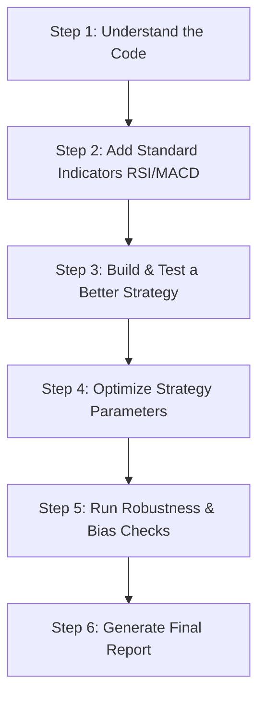

# 📈 Quantitative Trading & AI/ML: Project Learning Guide

Welcome to your learning journey! This document is designed to help you move from **"vibe coding"** (where the AI writes code and you just hope it works) to **deep understanding**. 

Since you have a strong background in the **Indian stock market** and want to build a career in **Quant Finance** and **AI/ML**, we will explain everything in simple terms, drawing parallels to Indian stock trading concepts.

---

## 🔍 Section 1: What is "Quant" (Quantitative Finance)?

If you invest in the Indian stock market (e.g., buying shares of Reliance, TCS, or HDFC Bank), you probably make decisions in one of two ways:
1. **Fundamental Analysis:** Looking at balance sheets, earnings reports, P/E ratios, and company growth.
2. **Technical Analysis:** Looking at charts, drawing support/resistance lines, looking for head-and-shoulders patterns, or checking RSI.

### The Quant Approach
**Quantitative Trading (Quant)** takes Technical and Fundamental Analysis and automates them using **math, programming, and data science**. 

Instead of looking at a chart of Reliance and saying, *"It looks like it's support level, let buy,"* a Quant writes a Python script that says:
> *"Scan the last 10 years of daily close prices. If the price falls 2 standard deviations below the 20-day moving average AND the volume is 1.5 times the 5-day average, buy. Otherwise, do nothing."*

### Why AI/ML Fits In
Traditional Quant strategies use simple mathematical rules (like moving average crossovers). Modern Quant (AI/ML) uses algorithms to:
* Find hidden patterns in data that humans can't see.
* Predict whether the price will go up or down over the next hour, day, or week.
* Manage risk automatically based on market volatility.

---

## 🏗️ Section 2: What Are We Building in This Project?

We are participating in a **BTC/USD Trading Strategy Backtesting Challenge**. The goal is to design a Python trading robot that trades Bitcoin (BTC) automatically and test how much money it would have made from 2019 to 2023.

### The Core Files in Your Project:
1. **`BTC_2019_2023_1d.csv`**: This is our historical data. It contains daily price bars. Each day has:
   * **Open:** The price at the start of the day.
   * **High/Low:** The highest and lowest prices reached that day.
   * **Close:** The price at the end of the day.
   * **Volume:** How much Bitcoin was traded that day.
2. [main.py](file:///d:/Quant/Basic%20Project/main.py): This is where **our strategy** lives. We write rules to generate trade signals.
3. [backtester.py](file:///d:/Quant/Basic%20Project/backtester.py): This is the simulator. It reads our signals, simulates buying and selling with a starting capital of **$1,000**, applies transaction fees (0.15%), and prints performance graphs and statistics.

---

## 🧠 Section 3: Essential Quant Terms Explained Simply

To get started, you must understand these 5 core concepts:

### 1. Long vs. Short
* **Long (Buy):** You buy an asset hoping the price goes up, then sell it later for a profit. (Standard investing).
* **Short (Sell):** You borrow an asset and sell it, hoping the price goes down. Later, you buy it back cheaper to return it, keeping the difference as profit. In crypto and derivatives (like Futures in India), shorting is very common.

### 2. Backtesting
Backtesting is running your trading rules on **past data** to see if they would have made money. It's like taking a strategy you want to use on Nifty 50 today, and running it on Nifty 50 data from 2010 to 2025 to see how it performed.

### 3. Lookahead Bias (The "Time-Travel" Trap) ⚠️
This is the most common mistake in quantitative finance! 
* **Definition:** Using information from the **future** to make a trading decision in the **present**.
* **Example:** Suppose today is Monday. If your code checks Tuesday's closing price to decide whether to buy on Monday, that's Lookahead Bias. In backtesting, your strategy will look like a money-printing machine, but when you deploy it in real life (where you can't see tomorrow), it will fail miserably.
* **Our Project Solution:** [main.py](file:///d:/Quant/Basic%20Project/main.py) has a built-in lookahead bias checker. It runs the strategy step-by-step to make sure it only looks backward, never forward.

### 4. Sharpe Ratio (Risk-Adjusted Return)
In trading, high returns are great, but not if you had to take insane risks. 
* The **Sharpe Ratio** measures how much extra return you get for the volatility (risk) you endure.
* **Analogy:** If Strategy A makes 20% profit with wild swings (huge losses and huge gains), and Strategy B makes 18% profit with very smooth, steady gains, Strategy B will have a much higher Sharpe Ratio.
* **Rule of thumb:** 
  * `< 1.0`: Suboptimal/Poor risk-adjusted return.
  * `1.0 to 1.9`: Good.
  * `2.0 to 2.9`: Very Good.
  * `> 3.0`: Excellent (rare in daily trading).

### 5. Drawdown (The Pain Metric)
* **Definition:** The percentage drop from the highest peak of your account value to the lowest valley.
* **Example:** If your $1,000 capital grows to $2,000, but then falls to $1,200 before rising to $3,000, your maximum drawdown was **40%** (loss from $2,000 peak down to $1,200). 
* As a trader, you want low drawdown because high drawdown leads to panic selling and running out of money.

---

## 💻 Section 4: What Does the Current Code Do?

Let's dissect the current example strategy in [main.py](file:///d:/Quant/Basic%20Project/main.py) so you know exactly how it works:

### 1. Processing Data (`process_data`):
It calculates the **ATR (Average True Range)**. 
> **What is ATR?** It measures how much an asset moves on average over a certain period (14 days here). If BTC fluctuates wildly, ATR is high. If it moves slowly, ATR is low. It's a measure of market volatility.

### 2. The Strategy Logic (`strat`):
The strategy searches for **Volume Spikes** (when volume is higher than average volume + 1.5 standard deviations) to enter trades.

* **Buying (Going Long):** If there's a volume spike and the day's candle is green (Close > Open), we buy.
  * *Trailing Stop-Loss:* Once we buy, we set a Stop-Loss at `Close - (2 * ATR)`. If the price drops below this level, we sell to cut our losses. As the price goes up, our stop-loss level trails (moves up) behind it.
* **Shorting (Going Short):** If there's a volume spike and the day's candle is red (Close < Open), we short.
  * *Trailing Stop-Loss:* Set at `Close + (2 * ATR)`. If the price rises above this, we close the trade.
* **Exiting (Closing Trades):**
  * If the trend reverses (opposite signal appears).
  * If the price goes against us for 3 consecutive days.
  * If our trailing stop-loss is hit.

---

## 🛠️ Section 5: The Technology Stack & Skills

To work on this project and build your career, you are using:

| Tech/Skill | What it does | Why it's important for your career |
| :--- | :--- | :--- |
| **Python** | The core programming language. | The industry standard for Quant and AI/ML. |
| **Pandas** | A data manipulation library (handling tables, CSVs, time-series data). | Used every day to load, clean, and analyze market data. |
| **Numpy** | High-performance mathematical arrays. | Used for fast indicators, metrics calculations. |
| **TA-Lib & Pandas-TA** | Libraries with built-in financial formulas (RSI, MACD, ATR). | Speeds up indicator calculations so you don't have to code them from scratch. |
| **Plotly / Matplotlib** | Interactive and static graphing libraries. | Essential for visualizing strategy performance, PnL, and drawdowns. |
| **Backtesting Methodology** | Understanding entry/exit, fees, slippage, and portfolio compounding. | Prevents you from losing real money by identifying weak strategies on historical data. |

---

## 🗺️ Our Project Roadmap: Moving Forward

Here is how we will progress through this project. We will do it step-by-step so you learn at each stage:

### Let's commit to this together:
Whenever I propose a change, I will explain **why** we are doing it, **what** the indicator represents mathematically, and **how** it affects the returns. You can ask questions about any line of code you don't understand!

---
*Tip: Keep this guide open in your editor as we build. To view the files or code snippets, you can click on the file links throughout the document.*
