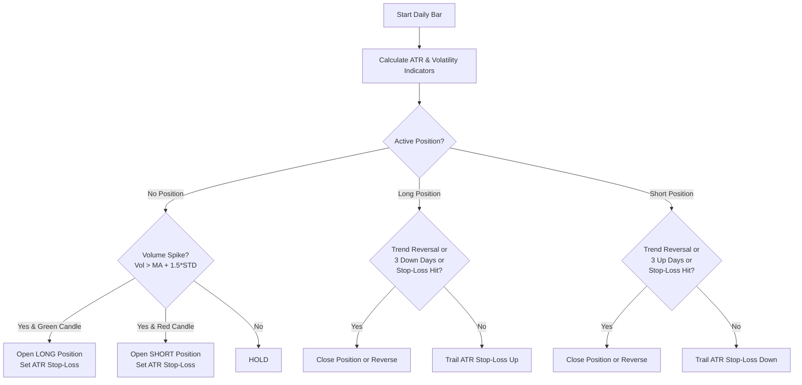

# 📈 SatoshiFlow: Quantitative Trading & AI/ML Learning Platform

Welcome to **SatoshiFlow**, a robust, modular quantitative research and backtesting platform designed to transition trading concepts from theory to production-grade implementation. The repository provides a sandbox for building, backtesting, validating, and optimizing algorithmic trading strategies on cryptocurrency time-series data.

---

## 📂 Repository Structure

```
SatoshiFlow/
├── LEARNING_GUIDE.md              # Concepts guide (Drawdowns, Sharpe Ratio, Lookahead Bias)
├── README.md                      # Platform documentation and quickstart
└── Basic Project/                 # Core Python engine and analytical scripts
    ├── btc_18_22_1d.csv           # Historical OHLCV Bitcoin data (2018-2022)
    ├── main.py                    # Strategy entrypoint with indicators and strategy
    ├── backtester.py              # Event-driven backtesting execution engine
    └── Problem_statement.pdf      # Original challenge requirements
```

---

## ⚙️ Core Architecture & Features

SatoshiFlow is structured into decoupled components to facilitate clean, professional quantitative workflows:

### 1. Mathematical Indicators Engine (`main.py`)
Calculates clean technical indicators from raw OHLCV inputs without relying on black-box libraries, ensuring transparency and math clarity:
*   **Average True Range (Wilder's Smoothing ATR):** Custom implementation for tracking asset volatility.
*   **Average Directional Index (ADX, DI+, DI-):** Measures trend strength and direction.
*   **Exponential Moving Averages (EMA):** Fast and slow lines for crossover and trend-following detection.
*   **Donchian Channels:** High/low bounds for volatility and breakout signals.
*   **Volume Z-Score & Moving Average:** Quantifies volume anomalies.
*   **Bollinger Bands & %B:** Volatility envelopes for mean-reversion analysis.

### 2. Event-Driven Backtesting Simulator (`backtester.py`)
Simulates realistic trade execution by processing bar-by-bar states:
*   **Order Execution Model:** Emulates standard long, short, and reversal positions.
*   **Capital Management:** Supports compound interest capital allocation models.
*   **Risk Constraints:** Integrates Stop-Loss (SL) and Take-Profit (TP) triggers checking intraday highs/lows.
*   **Fee Friction:** Deducts a standard transaction fee of `0.15%` (`0.0015`) per trade side.
*   **Metric Computations:** Calculates win rates, Sharpe/Sortino ratios, streaks, holding durations, and maximum drawdowns.

### 3. Strategy Implementation (`main.py`)
The implemented strategy is a **Regime-Filtered Trend Follower**:
*   **Entry:** Donchian breakout (20-day high/low) when ADX > threshold
*   **Exit:** ATR trailing stop (2x multiplier)
*   **Regime Filter:** Only trades when ADX > 20-25, avoiding choppy markets
*   **Position Sizing:** 100% equity allocation per trade

### 4. Verification & Bias Checks
*   **Lookahead Bias Checker:** A temporal isolation unit running in `main.py` verifies that signals are strictly historical and no future data leaks into the indicator pipeline.

---

## 🚀 Getting Started

### 1. Prerequisites
Ensure you have Python 3.8+ installed. You can install all dependencies via `pip`:

```bash
pip install pandas numpy matplotlib plotly
```

### 2. Running the Complete Pipeline
You can run the end-to-end orchestration pipeline to load historical data, compute indicators, optimize thresholds, backtest, and generate reports:

```bash
cd "Basic Project"
python run_analysis.py
```

This pipeline automatically:
1. Performs walk-forward optimization across multiple thresholds.
2. Identifies the optimal parameter.
3. Generates and exports:
   *   `analysis_report.csv` — Comprehensive execution statistics.
   *   `equity_curve.png` — Comparison of strategy equity vs. asset price.
   *   `performance_metrics.png` — Drawdown profile and daily return distributions.

---

## 📊 Strategy Logic Example

The baseline strategy implemented in `main.py` is a **Volatility-Adjusted Volume Spike Trend Follower**:



### Signal Execution Details:
*   **Entries:** Triggered by a volume spike (volume exceeding 1.5 standard deviations above the 5-day mean) coupled with a directional day-candle close.
*   **Trailing Stop-Loss:** Calculated dynamically using `Close +/- (2 * ATR)`. The stop-loss is updated only in the favorable direction to lock in profits.
*   **Exits:** Enforced via stop-loss execution, trend reversal signals, or temporal exits (e.g. 3 consecutive days of adverse price movement).

---

## 📈 Performance Metrics Dictionary

The backtesting framework reports the following primary metrics:

| Metric | Calculation Method | Purpose |
| :--- | :--- | :--- |
| **Net Profit** | `Gross Gains - Gross Losses - Transaction Fees` | Measures overall strategy profitability. |
| **Win Rate (%)** | `(Winning Trades / Total Trades) * 100` | Indicates accuracy of entry signals. |
| **Sharpe Ratio** | Annualized daily risk-adjusted returns using `sqrt(365)` normalizer | Evaluates returns adjusted for volatility. |
| **Maximum Drawdown (%)** | Percentage peak-to-trough capital loss | Quantifies the maximum risk exposure. |
| **Streaks** | Maximum consecutive wins/losses | Assesses tail risk and psychological impact. |
| **Benchmark Return** | Buy-and-hold returns on the underlying asset | Measures strategy outperformance. |

---

## 🛠️ Extensibility Guide

To build your own strategy:
1. Open `Basic Project/main.py`.
2. Define a new signal generating function similar to `strat(data)`. Signals must be encoded as follows:
   *   `0`: Hold current position.
   *   `1` / `-1`: Open Long / Short position.
   *   `2` / `-2`: Reverse Short to Long / Long to Short.
3. Configure the backtester in `main()` with your strategy name and output CSV:
   ```python
   bt = BackTester("BTC", signal_data_path="final_data.csv", compound_flag=1)
   bt.get_trades(trade_amt=1000)
   ```
4. Verify lack of lookahead bias using the built-in checker:
   ```python
   # main.py already executes a temporal simulation to verify indicator consistency.
   ```
